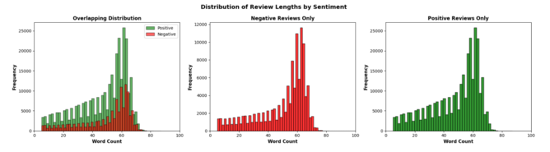
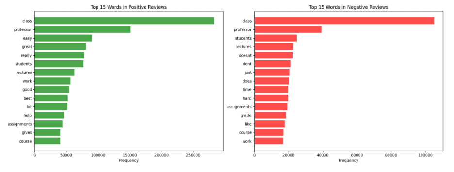

# SOSC 314 Final Project  
## Sentiment Analysis of RateMyProfessors Reviews
- [SOSC 314 Final Project](#sosc-314-final-project)
  - [Sentiment Analysis of RateMyProfessors Reviews](#sentiment-analysis-of-ratemyprofessors-reviews)
    - [Author](#author)
    - [Course](#course)
  - [Project Overview](#project-overview)
  - [Research Question](#research-question)
  - [Data Source](#data-source)
    - [Original Variables](#original-variables)
  - [Data Cleaning and Preprocessing](#data-cleaning-and-preprocessing)
    - [Rating Standardization](#rating-standardization)
    - [Sentiment Construction](#sentiment-construction)
    - [Text Filtering and Normalization](#text-filtering-and-normalization)
    - [Date Processing](#date-processing)
  - [Exploratory Data Analysis](#exploratory-data-analysis)
    - [Review Length by Sentiment](#review-length-by-sentiment)
  - 
    - [Word Frequency Patterns](#word-frequency-patterns)
  - 
    - [Rating Trends Over Time](#rating-trends-over-time)
  - 
    - [Class Imbalance](#class-imbalance)
  - [Modeling Strategy (Planned)](#modeling-strategy-planned)
    - [Logistic Regression](#logistic-regression)
    - [Naive Bayes](#naive-bayes)
  - [Project Goals](#project-goals)

### Author
**Bikalpa Panthi**

### Course
SOSC 314

---

## Project Overview

This project analyzes student-written reviews from **RateMyProfessors** to examine what information open-text feedback provides beyond numerical ratings. Using natural language processing (NLP) and supervised machine learning techniques, the project investigates whether textual reviews can reveal actionable pedagogical insights that numerical ratings alone may fail to capture.

The project frames this as a **text-as-data classification problem**, using student comments to infer sentiment derived from professor ratings.

---

## Research Question

> **What information do open-text student reviews provide beyond numerical ratings, and can text analysis identify actionable feedback that ratings alone cannot capture?**

Earlier versions of the project focused on predicting numerical ratings from text, but the research direction evolved toward interpretability and instructional relevance.

---

## Data Source

- **Dataset**: RateMyProfessors Reviews  
- **Source**: Hugging Face  
- **Link**: https://huggingface.co/datasets/ZephyrUtopia/ratemyprofessors_reviews  

The dataset contains **480,342 observations**, with each observation representing a single student review.

### Original Variables
- `name` – reviewer name  
- `text` – written student comment  
- `rating` – numerical rating (1–5, including .5 increments)  
- `difficulty` – perceived course difficulty  
- `date` – date of review  

The **unit of analysis** is an individual student-written review.

---

## Data Cleaning and Preprocessing

Several preprocessing decisions were made to improve data quality and modeling performance.

### Rating Standardization
- Removed ratings ending in `.5` due to sparsity and irregularity  
- Converted ratings from string to numeric format  

### Sentiment Construction
- Constructed a **binary sentiment outcome**:
  - **Positive**: ratings of 4 or 5  
  - **Negative**: ratings of 1 or 2  
- Removed neutral ratings of 3 to reduce label ambiguity  

### Text Filtering and Normalization
- Removed reviews with fewer than **5 words**  
- Checked for and removed duplicate comments  
- Converted all text to lowercase  
- Removed URLs, punctuation, and extra whitespace  

### Date Processing
- Converted date values from string to date format  
- Enabled temporal trend analysis  

Cleaned datasets were saved to ensure **reproducibility** of results.

---

## Exploratory Data Analysis

This section summarizes key descriptive patterns observed in the cleaned dataset.

### Review Length by Sentiment

Positive reviews tend to be **longer** than negative reviews, suggesting that satisfied students provide more detailed feedback.

---

### Word Frequency Patterns

Distinct word usage patterns emerge across sentiments.  
Positive reviews frequently include words such as *easy*, *helpful*, *clear*, and *great*, while negative reviews more often include terms like *hard*, *exam*, *confusing*, and *grade*.

---

### Rating Trends Over Time

The proportion of positive versus negative reviews remains relatively stable across years. More recent years show greater consistency due to higher data volume.

---

### Class Imbalance

The dataset is highly imbalanced, with substantially more positive than negative reviews.  
There are approximately **2.62 positive reviews for every negative review**, which presents a modeling challenge.

---

## Modeling Strategy (Planned)

The following models will be implemented in later stages of the project.

### Logistic Regression
- Provides interpretable coefficients  
- Identifies words with the strongest predictive power  
- Enables extraction of actionable pedagogical insights  

### Naive Bayes
- Serves as a baseline comparison model  
- Helps validate consistency across modeling approaches  

The data will be split into **training, validation, and test sets**, using stratification to preserve class proportions.

---

## Project Goals

- Identify instructional insights embedded in student comments  
- Demonstrate how text can supplement numerical evaluations  
- Connect subjective student feedback to measurable outcomes using text as data  

---
