# SOSC 314 Final Project  
## Sentiment Analysis of RateMyProfessors Reviews
- [SOSC 314 Final Project](#sosc-314-final-project)
  - [Sentiment Analysis of RateMyProfessors Reviews](#sentiment-analysis-of-ratemyprofessors-reviews)
    - [Author](#author)
    - [Course](#course)
  - [Project Overview](#project-overview)
  - [Research Question](#research-question)
  - [Data Source](#data-source)
    - [Original Variables](#original-variables)
  - [Data Cleaning and Preprocessing](#data-cleaning-and-preprocessing)
    - [Rating Standardization](#rating-standardization)
    - [Sentiment Construction](#sentiment-construction)
    - [Text Filtering and Normalization](#text-filtering-and-normalization)
    - [Date Processing](#date-processing)
  - [Exploratory Data Analysis](#exploratory-data-analysis)
    - [Review Length by Sentiment](#review-length-by-sentiment)
  - 
    - [Word Frequency Patterns](#word-frequency-patterns)
  - 
    - [Rating Trends Over Time](#rating-trends-over-time)
  - 
    - [Class Imbalance](#class-imbalance)
  - [Modeling Strategy (Planned)](#modeling-strategy-planned)
    - [Logistic Regression](#logistic-regression)
    - [Naive Bayes](#naive-bayes)
  - [Project Goals](#project-goals)
  - [Week 4: Model Implementation and Operationalization](#week-4-model-implementation-and-operationalization)
    - [Operationalization of Key Concepts](#operationalization-of-key-concepts)
      - [TF-IDF Representation](#tf-idf-representation)
      - [Vocabulary Decisions (What counts as a “feature”?)](#vocabulary-decisions-what-counts-as-a-feature)
      - [Domain Stopwords](#domain-stopwords)
    - [Controlled Experiments: How Preprocessing Choices Affect Results](#controlled-experiments-how-preprocessing-choices-affect-results)
      - [Experiment 1: Effect of Domain Stopwords](#experiment-1-effect-of-domain-stopwords)
      - [Experiment 2: Vocabulary Size Comparison](#experiment-2-vocabulary-size-comparison)
      - [Experiment 3: N-grams (Unigrams vs Unigrams+Bigrams)](#experiment-3-n-grams-unigrams-vs-unigramsbigrams)
      - [Experiment 4: Effect of Stemming](#experiment-4-effect-of-stemming)
  - [Final Model Training: Logistic Regression vs Naive Bayes](#final-model-training-logistic-regression-vs-naive-bayes)
    - [Model 1: Logistic Regression](#model-1-logistic-regression)
    - [Model 2: Naive Bayes](#model-2-naive-bayes)
    - [Model Comparison (Key Takeaways)](#model-comparison-key-takeaways)
  - [Confusion Matrix Analysis](#confusion-matrix-analysis)
  - [Feature Importance and Substantive Interpretation](#feature-importance-and-substantive-interpretation)
    - [Logistic Regression: Top Predictive Words (Examples)](#logistic-regression-top-predictive-words-examples)
    - [Naive Bayes: Phrase-Level Predictors (Examples)](#naive-bayes-phrase-level-predictors-examples)
  - [Actionable Insights for Instructors](#actionable-insights-for-instructors)
    - [What Drives Positive Reviews](#what-drives-positive-reviews)
    - [What Drives Negative Reviews](#what-drives-negative-reviews)
  - [Saving Models and Results](#saving-models-and-results)
  - [Week 5: Diagnostics, Robustness \& Validity](#week-5-diagnostics-robustness--validity)
  - [Feature Stability Analysis](#feature-stability-analysis)
    - [1) K-Fold Feature Importance](#1-k-fold-feature-importance)
    - [2) Bootstrap Coefficient Stability](#2-bootstrap-coefficient-stability)
    - [Feature Stability Summary](#feature-stability-summary)
  - [Robustness Checks](#robustness-checks)
    - [1) Cross-Validation Robustness](#1-cross-validation-robustness)
    - [2) Temporal Validation (Sequential Split Simulation)](#2-temporal-validation-sequential-split-simulation)
    - [3) Sample Size Sensitivity](#3-sample-size-sensitivity)
  - [Classification Diagnostics](#classification-diagnostics)
    - [1) Calibration Curves](#1-calibration-curves)
    - [2) ROC Curves and AUC](#2-roc-curves-and-auc)
    - [3) Precision–Recall Curves](#3-precisionrecall-curves)
    - [Classification Diagnostics Summary](#classification-diagnostics-summary)
  - [Error Analysis](#error-analysis)
    - [1) Error Type Categorization](#1-error-type-categorization)
    - [2) Confidence Analysis](#2-confidence-analysis)
    - [3) Example Misclassifications (Qualitative)](#3-example-misclassifications-qualitative)
  - [Week 5 Takeaways](#week-5-takeaways)
  - [Week 6: Synthesis \& Communication Readiness](#week-6-synthesis--communication-readiness)
    - [Final Analytic Configuration and Stopping Justification](#final-analytic-configuration-and-stopping-justification)
    - [Substantive Interpretation of Results](#substantive-interpretation-of-results)
    - [Limitations and Scope](#limitations-and-scope)
    - [Draft Presentation Figures](#draft-presentation-figures)
    - [GitHub Repository and Reproducibility](#github-repository-and-reproducibility)
  - [Week 6 Takeaways](#week-6-takeaways)

### Author
**Bikalpa Panthi**

### Course
SOSC 314

---

## Project Overview

This project analyzes student-written reviews from **RateMyProfessors** to examine what information open-text feedback provides beyond numerical ratings. Using natural language processing (NLP) and supervised machine learning techniques, the project investigates whether textual reviews can reveal actionable pedagogical insights that numerical ratings alone may fail to capture.

The project frames this as a **text-as-data classification problem**, using student comments to infer sentiment derived from professor ratings.

---

## Research Question

> **What information do open-text student reviews provide beyond numerical ratings, and can text analysis identify actionable feedback that ratings alone cannot capture?**

Earlier versions of the project focused on predicting numerical ratings from text, but the research direction evolved toward interpretability and instructional relevance.

---

## Data Source

- **Dataset**: RateMyProfessors Reviews  
- **Source**: Hugging Face  
- **Link**: https://huggingface.co/datasets/ZephyrUtopia/ratemyprofessors_reviews  

The dataset contains **480,342 observations**, with each observation representing a single student review.

### Original Variables
- `name` – reviewer name  
- `text` – written student comment  
- `rating` – numerical rating (1–5, including .5 increments)  
- `difficulty` – perceived course difficulty  
- `date` – date of review  

The **unit of analysis** is an individual student-written review.

---

## Data Cleaning and Preprocessing

Several preprocessing decisions were made to improve data quality and modeling performance.

### Rating Standardization
- Removed ratings ending in `.5` due to sparsity and irregularity  
- Converted ratings from string to numeric format  

### Sentiment Construction
- Constructed a **binary sentiment outcome**:
  - **Positive**: ratings of 4 or 5  
  - **Negative**: ratings of 1 or 2  
- Removed neutral ratings of 3 to reduce label ambiguity  

### Text Filtering and Normalization
- Removed reviews with fewer than **5 words**  
- Checked for and removed duplicate comments  
- Converted all text to lowercase  
- Removed URLs, punctuation, and extra whitespace  

### Date Processing
- Converted date values from string to date format  
- Enabled temporal trend analysis  

Cleaned datasets were saved to ensure **reproducibility** of results.

---

## Exploratory Data Analysis

This section summarizes key descriptive patterns observed in the cleaned dataset.

### Review Length by Sentiment

Positive reviews tend to be **longer** than negative reviews, suggesting that satisfied students provide more detailed feedback.

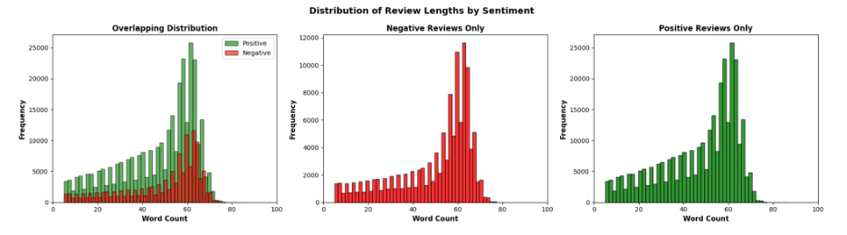
---

### Word Frequency Patterns

Distinct word usage patterns emerge across sentiments.  
Positive reviews frequently include words such as *easy*, *helpful*, *clear*, and *great*, while negative reviews more often include terms like *hard*, *exam*, *confusing*, and *grade*.

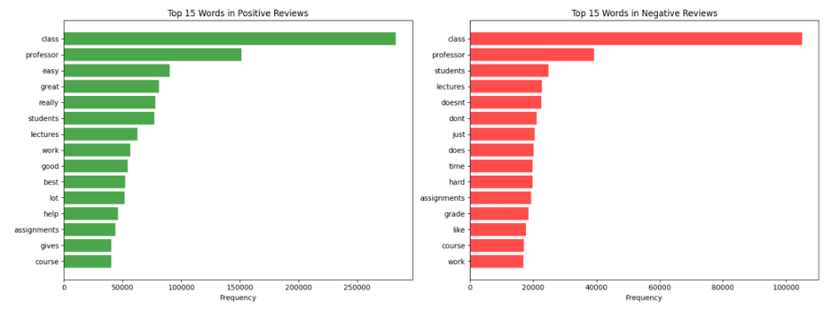
---

### Rating Trends Over Time

The proportion of positive versus negative reviews remains relatively stable across years. More recent years show greater consistency due to higher data volume.

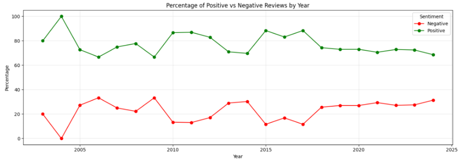
---

### Class Imbalance

The dataset is highly imbalanced, with substantially more positive than negative reviews.  
There are approximately **2.62 positive reviews for every negative review**, which presents a modeling challenge.

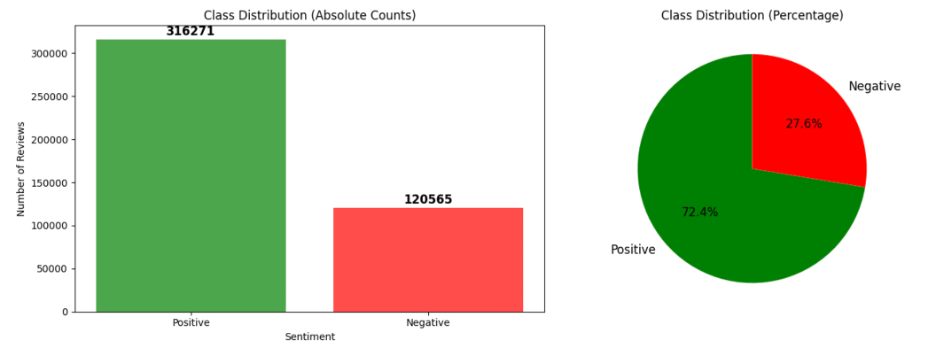

---

## Modeling Strategy (Planned)

The following models will be implemented in later stages of the project.

### Logistic Regression
- Provides interpretable coefficients  
- Identifies words with the strongest predictive power  
- Enables extraction of actionable pedagogical insights  

### Naive Bayes
- Serves as a baseline comparison model  
- Helps validate consistency across modeling approaches  

The data will be split into **training, validation, and test sets**, using stratification to preserve class proportions.

---

## Project Goals

- Identify instructional insights embedded in student comments  
- Demonstrate how text can supplement numerical evaluations  
- Connect subjective student feedback to measurable outcomes using text as data  

---

## Week 4: Model Implementation and Operationalization

This week implements and evaluates supervised learning models to classify **student review sentiment** from text, with a focus on how different **operationalization and preprocessing decisions** change model performance.

---

### Operationalization of Key Concepts

#### TF-IDF Representation
To convert text into model-ready numeric features, reviews are represented using **TF-IDF (Term Frequency–Inverse Document Frequency)**:
- **TF** increases weight for terms that appear often in a given review
- **IDF** downweights terms that appear in many reviews overall (e.g., generic words like “professor”)
- This helps surface more **sentiment-distinguishing** words rather than universally common terms

#### Vocabulary Decisions (What counts as a “feature”?)
Key vectorizer choices tested and tuned:
- `max_features` to cap vocabulary size and reduce overfitting/noise
- `min_df` to remove extremely rare words (typos, one-offs)
- `max_df` to remove ultra-common words
- `ngram_range` to include phrases (e.g., “not helpful”) in addition to single words

#### Domain Stopwords
In addition to standard stopwords, a domain-specific list of common course-related words (e.g., “class”, “professor”) was tested to see whether removing them improves signal.

---

### Controlled Experiments: How Preprocessing Choices Affect Results

We ran controlled experiments comparing **Logistic Regression (LR)** and **Naive Bayes (NB)** under different preprocessing/feature configurations.

#### Experiment 1: Effect of Domain Stopwords
- **Standard stopwords only**
  - LR: Accuracy **0.9345**, F1 **0.9538**
  - NB: Accuracy **0.9307**, F1 **0.9533**
- **Standard + domain stopwords**
  - LR: Accuracy **0.9265**, F1 **0.9480**
  - NB: Accuracy **0.9230**, F1 **0.9482**

**Result:** Removing domain stopwords slightly *reduced* accuracy/F1 in this setup (LR accuracy −0.0080; NB accuracy −0.0078).

#### Experiment 2: Vocabulary Size Comparison
- **5,000 features**
  - LR: Accuracy **0.9216**, F1 **0.9444**
  - NB: Accuracy **0.9176**, F1 **0.9448**
- **Larger vocabulary setting (as run in notebook)**
  - LR: Accuracy **0.9265**, F1 **0.9480**
  - NB: Accuracy **0.9230**, F1 **0.9482**

**Result:** A larger vocabulary improved both models modestly.

#### Experiment 3: N-grams (Unigrams vs Unigrams+Bigrams)
- **Unigrams only (1,1)**
  - LR: Accuracy **0.9201**, F1 **0.9433**
  - NB: Accuracy **0.9073**, F1 **0.9388**
- **Unigrams + bigrams (1,2)**
  - LR: Accuracy **0.9265**, F1 **0.9480**
  - NB: Accuracy **0.9230**, F1 **0.9482**

**Result:** Adding bigrams helped both models—especially Naive Bayes—by capturing phrase-level sentiment (e.g., “not good”, “very helpful”).

#### Experiment 4: Effect of Stemming
- **Without stemming**
  - LR: Accuracy **0.9265**, F1 **0.9480**
  - NB: Accuracy **0.9230**, F1 **0.9482**
- **With stemming**
  - LR: Accuracy **0.9248**, F1 **0.9468**
  - NB: Accuracy **0.9222**, F1 **0.9477**

**Result:** Stemming slightly reduced performance and can reduce interpretability.

**Controlled Experiments Summary Figure:**  
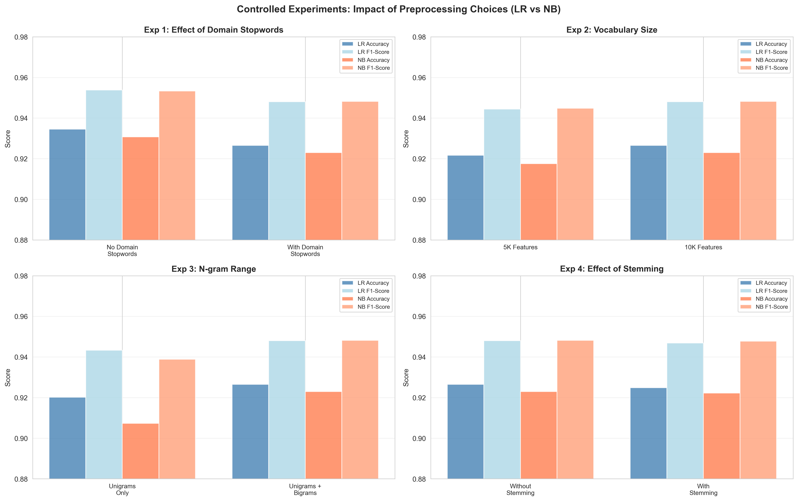

---

## Final Model Training: Logistic Regression vs Naive Bayes

Using the selected configuration (TF-IDF with tuned vocabulary and n-gram settings), we trained two final models.

### Model 1: Logistic Regression
**Validation Results**
- Accuracy: **0.9268**
- Precision (Positive): **0.9711**
- Recall (Positive): **0.9264**
- F1: **0.9482**

**Why LR?**
- Highly interpretable via coefficients (word-level contributions)
- Handles high-dimensional sparse text features well
- Can address imbalance (e.g., via class weighting)

### Model 2: Naive Bayes
**Validation Results**
- Accuracy: **0.9230**
- Precision (Positive): **0.9234**
- Recall (Positive): **0.9744**
- F1: **0.9482**

**Why NB?**
- Fast and strong baseline for text classification
- Often effective despite independence assumptions

### Model Comparison (Key Takeaways)
- LR has **higher precision** (fewer false positives)
- NB has **higher recall** for positive class (fewer false negatives)
- Both achieve essentially identical F1 (~0.948)

**Model Comparison Visualization:**  
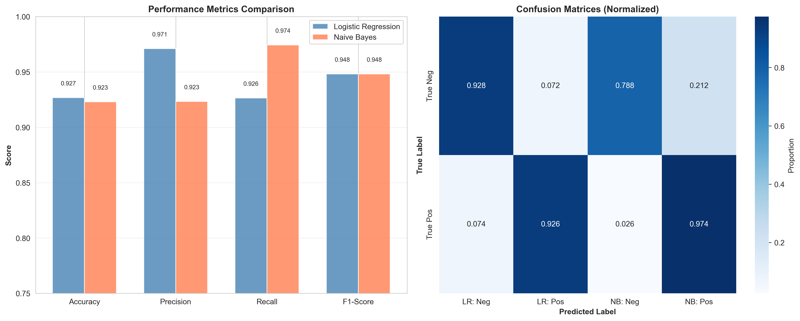

---

## Confusion Matrix Analysis

**Logistic Regression**
- True Negatives: **22,421**
- False Positives: **1,743**
- False Negatives: **4,651**
- True Positives: **58,552**

**Naive Bayes**
- True Negatives: **19,053**
- False Positives: **5,111**
- False Negatives: **1,620**
- True Positives: **61,583**

**Confusion Matrices Figure:**  
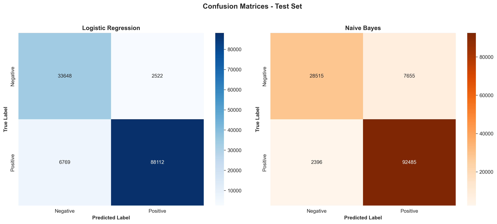

---

## Feature Importance and Substantive Interpretation

### Logistic Regression: Top Predictive Words (Examples)

**Strong positive predictors include:**  
`amazing`, `great`, `awesome`, `loved`, `cares`, `excellent`, `easy`, `wonderful`, `helped`, `fun`

**Strong negative predictors include:**  
`confusing`, `useless`, `unclear`, `poor`, `unprofessional`, `disorganized`, `awful`, `horrible`, `rude`, `avoid`, `worst`

### Naive Bayes: Phrase-Level Predictors (Examples)

**Positive predictors include phrases like:**  
`best professors`, `truly cares`, `wont regret`, `absolutely loved`, `genuinely cares`

**Negative predictors include phrases like:**  
`avoid taking`, `hands worst`, `worst experience`, `extremely rude`, `literally worst`

**Top Predictive Words Visualization:**  
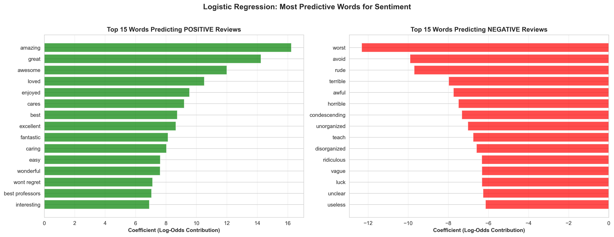

---

## Actionable Insights for Instructors

### What Drives Positive Reviews
1. **Demonstrate care/support** (approachability, responsiveness, willingness to help)
2. **Provide structure and clarity** (organized pacing, clear expectations)
3. **Make content accessible** (explanations that reduce confusion)

### What Drives Negative Reviews
1. **Avoid interpersonal conflict signals** (e.g., “rude”, “condescending”, “unprofessional”)
2. **Reduce disorganization** (clear materials, consistent grading/communication)
3. **Minimize confusion** (tighten explanations and course structure)

---

## Saving Models and Results

To support reproducibility and later deployment/testing:
- Saved Logistic Regression model (`model_lr.pkl`)
- Saved Naive Bayes model (`model_nb.pkl`)
- Saved feature importance tables for both models (CSV)

---
---

## Week 5: Diagnostics, Robustness & Validity

After training the final Logistic Regression (LR) and Naive Bayes (NB) models, we run a set of **diagnostics and robustness checks** to answer:

- Are the model’s “important words” stable, or do they change a lot depending on the sample?
- Do results hold up across different train/test splits (robustness)?
- Are predicted probabilities trustworthy (calibration)?
- Where do the models fail, and what kinds of text cause misclassifications?

---

## Feature Stability Analysis

Feature stability asks whether the model’s most important features (words/phrases) remain important **across different samples of the data**. If “top words” change drastically from run to run, interpretation becomes less reliable and may indicate overfitting.

We assess stability with two complementary methods:

1. **K-Fold Feature Importance (Coefficient Stability Across Folds)**
2. **Bootstrap Coefficient Stability (Resampling-Based Confidence Intervals)**

---

### 1) K-Fold Feature Importance

**Goal:** Check whether the same features keep appearing as “top predictors” across different train/test splits.

**Approach (Conceptually):**
- Split training data into *k* folds.
- Train LR on each fold.
- Track each feature’s coefficient across folds.
- Compute:
  - **Mean coefficient** (average effect)
  - **Std dev** across folds (variability)
  - **Coefficient of Variation (CV = std/mean)** as a stability measure
  - **Stability score** = how often a feature appears in the **Top-K** features across folds

**Interpretation:**
- **High stability score** + **low CV** → consistently important feature
- **Low stability score** or **high CV** → feature importance depends on the split (less reliable)

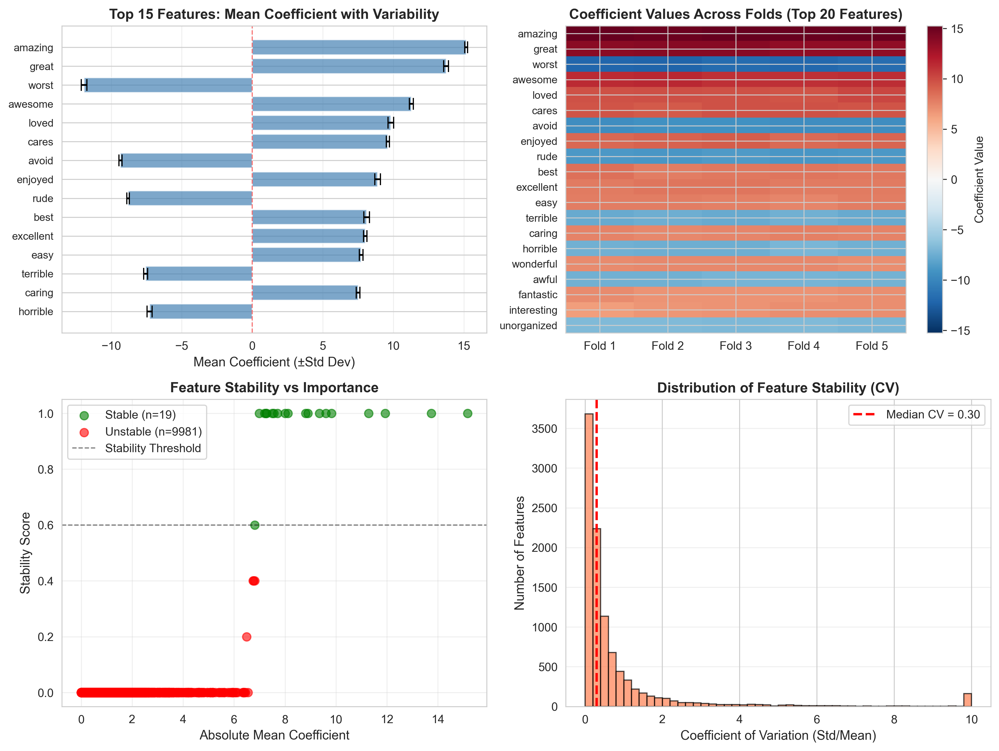

---

### 2) Bootstrap Coefficient Stability

**Goal:** Quantify uncertainty in feature coefficients by repeatedly retraining the model on resampled datasets.

**Approach (Conceptually):**
- Draw many bootstrap samples (sample with replacement).
- Train LR on each bootstrap sample.
- For each feature, summarize the coefficient distribution:
  - **Median coefficient**
  - **95% CI width** (narrow = stable)
  - **Sign consistency** (% of runs where coefficient stays positive/negative)
  - Whether the **CI includes 0** (suggesting uncertain direction)

**Interpretation:**
- **Narrow CI** + **high sign consistency** → reliable directional effect
- **Wide CI** or **CI includes 0** → unstable or weakly identified feature

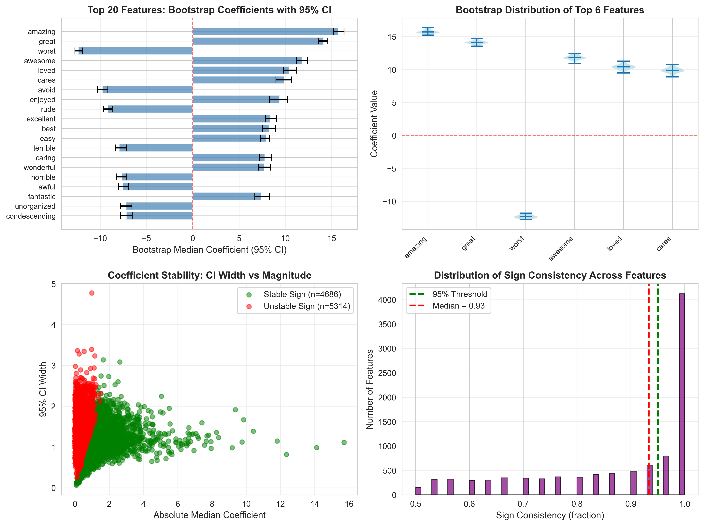

---

### Feature Stability Summary

| Method | Stability Measure | What It Tells Us | What “Good” Looks Like |
|-------|-------------------|------------------|-------------------------|
| K-Fold CV | Stability score | How often a feature appears in Top-K | Higher (e.g., ≥ 0.60) |
| K-Fold CV | Coefficient of Variation (CV) | Fold-to-fold coefficient volatility | Lower is better |
| Bootstrap | 95% CI width | Uncertainty in coefficient estimate | Narrower is better |
| Bootstrap | Sign consistency | Confidence in direction (±) | High (e.g., ≥ 95%) |
| Bootstrap | CI includes 0 | Whether effect direction is ambiguous | Prefer “No” |

**Key takeaway:** Features that are stable in *both* K-fold and bootstrap analyses are the most defensible for substantive interpretation.

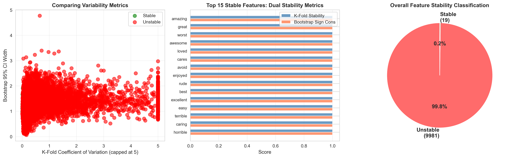

---

## Robustness Checks

Robustness checks test whether model performance is **consistent** under different evaluation conditions, rather than being an artifact of a single split or sampling decision.

We run three robustness checks:

1. **Cross-Validation Robustness**
2. **Temporal Validation (Sequential Split Simulation)**
3. **Sample Size Sensitivity**

---

### 1) Cross-Validation Robustness

**Goal:** Ensure performance is not dependent on one particular train/validation split.

**Approach (Conceptually):**
- Use **stratified k-fold cross-validation** to keep class ratios consistent per fold.
- Compute metrics across folds (mean ± std).

**What we look for:**
- **Small standard deviations** across folds → stable performance
- Consistent ranking (LR vs NB) → conclusions do not depend on a specific split

---

### 2) Temporal Validation (Sequential Split Simulation)

**Goal:** Test whether models trained on “earlier” data maintain performance on “later” data (deployment-like behavior).

**Important limitation:** The dataset does not provide reliable date features in the modeling table used here, so we **simulate** temporal drift by splitting the dataset in sequential order.

**Approach (Conceptually):**
- Split the data into:
  - **Early period (60%)**
  - **Middle period (20%)**
  - **Recent period (20%)**
- Evaluate scenarios like Early → Recent and Early+Middle → Recent.

**Results Summary (as reported by the notebook):**

| Train Period | Test Period | LR Accuracy | LR F1 | NB Accuracy | NB F1 |
|------------|-------------|------------:|------:|------------:|------:|
| Early (60%) | Middle (20%) | 0.9265 | 0.9277 | 0.9221 | 0.9201 |
| Early (60%) | Recent (20%) | 0.9271 | 0.9282 | 0.9232 | 0.9211 |
| Early+Middle (80%) | Recent (20%) | 0.9283 | 0.9294 | 0.9230 | 0.9210 |
| Standard Train | Standard Val | 0.9268 | 0.9280 | 0.9230 | 0.9210 |

**Interpretation:**
- Accuracy/F1 remain very similar across “time” splits → limited evidence of strong drift in this simulated setup.

---

### 3) Sample Size Sensitivity

**Goal:** Understand how much training data we need before performance saturates.

**Approach (Conceptually):**
- Train models on increasing fractions of the training set (10%, 25%, 50%, 100%).
- Evaluate on a fixed validation set.

**Results Summary (as reported by the notebook):**

| Training % | N Samples | LR Acc | LR F1 | NB Acc | NB F1 | LR − NB Gap |
|----------:|----------:|------:|-----:|------:|-----:|------------:|
| 10%  | 26,210  | 0.9133 | 0.9149 | 0.9098 | 0.9058 | 0.0035 |
| 25%  | 65,525  | 0.9194 | 0.9208 | 0.9190 | 0.9165 | 0.0003 |
| 50%  | 131,050 | 0.9232 | 0.9245 | 0.9216 | 0.9195 | 0.0016 |
| 100% | 262,101 | 0.9268 | 0.9280 | 0.9230 | 0.9210 | 0.0039 |

**Interpretation:**
- Both models improve with more data, but gains diminish as sample size grows.
- LR remains slightly better overall, though the gap is small.

---

## Classification Diagnostics

These diagnostics evaluate model behavior **beyond accuracy**, especially important for imbalanced datasets.

We focus on:
1. **Calibration curves** (probabilities match real-world frequencies)
2. **ROC curves / AUC** (overall ranking/separation ability)
3. **Precision–Recall curves / AP** (positive-class performance under imbalance)

---

### 1) Calibration Curves

**What it checks:** If the model predicts a review has 0.80 probability of being positive, then roughly **80%** of those should actually be positive.

**Why it matters:** Calibrated probabilities are crucial if predictions are used for downstream decisions (e.g., triaging reviews for follow-up).

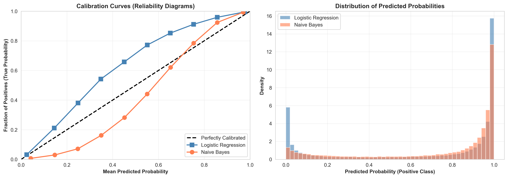

---

### 2) ROC Curves and AUC

**What it shows:** Tradeoff between:
- **True Positive Rate (Recall/Sensitivity)**
- **False Positive Rate**

**AUC** summarizes the ROC curve (1.0 = perfect, 0.5 = random).

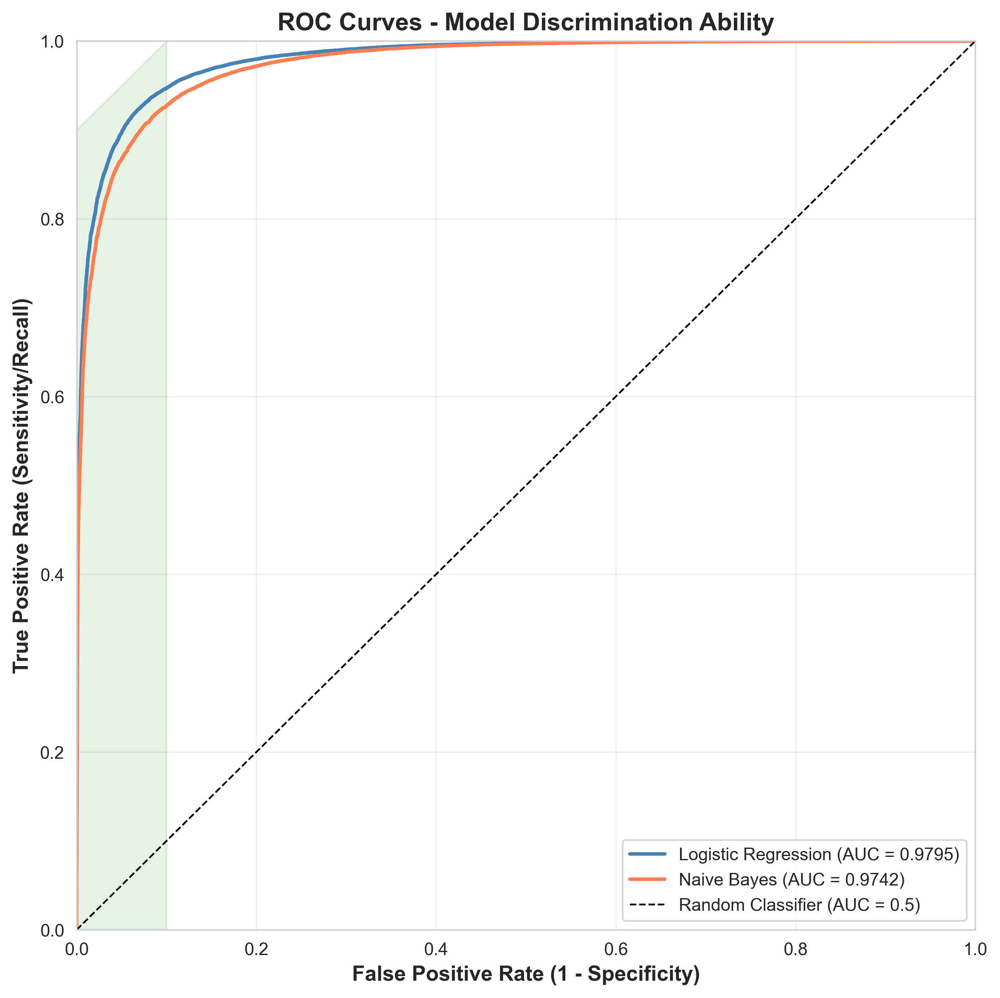

---

### 3) Precision–Recall Curves

Because the dataset is imbalanced, **PR curves** provide a clearer view of minority-class behavior than ROC curves.

**Average Precision (AP)** summarizes the PR curve; higher is better.

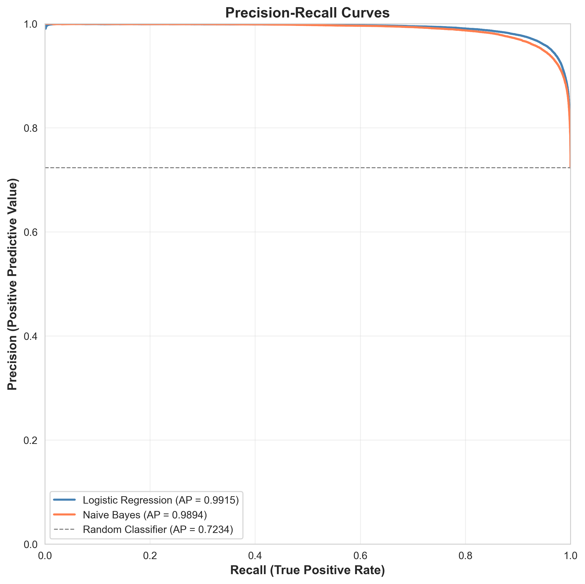

---

### Classification Diagnostics Summary

| Diagnostic | What It Reveals | Why It Matters |
|------------|-----------------|----------------|
| Calibration | Reliability of predicted probabilities | Needed for probability-based decisions |
| ROC-AUC | Overall discrimination ability | Threshold-independent comparison |
| Precision–Recall | Positive-class performance under imbalance | Better indicator under class imbalance |

**Key takeaway:** These plots help validate that model performance is not only “accurate,” but also useful and interpretable in decision settings.

---

## Error Analysis

To understand model limitations, we analyze misclassifications and group them into **interpretable error categories**.

### 1) Error Type Categorization

We categorize misclassified reviews into patterns such as:
- **Negation** (e.g., “not great”, “not that amazing…”)
- **Sarcasm** (tone mismatch; hard for bag-of-words models)
- **Mixed sentiment** (both positive and negative cues)
- **Other** (remaining errors that do not match the above)

**Error Distribution (as reported by the notebook):**

**Logistic Regression**
- Total errors: 6,394  
- Other: 3,160 (49.4%)  
- Negation: 2,852 (44.6%)  
- Sarcasm: 470 (7.4%)  
- Mixed sentiment: 386 (6.0%)

**Naive Bayes**
- Total errors: 6,731  
- Negation: 3,866 (57.4%)  
- Other: 2,563 (38.1%)  
- Sarcasm: 424 (6.3%)  
- Mixed sentiment: 388 (5.8%)

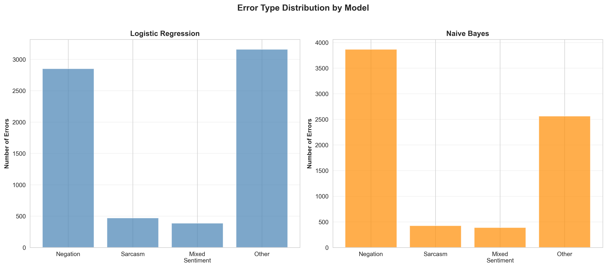

**Interpretation:**
- Negation is a major failure mode for both models (especially NB), which is expected in bag-of-words/TF-IDF pipelines unless negation handling is explicitly modeled.

---

### 2) Confidence Analysis

We compare **model confidence** on correct vs incorrect predictions to see whether errors tend to occur at low confidence (good) or high confidence (more concerning).

**Reported by the notebook:**

**Logistic Regression**
- Correct predictions: mean confidence 0.924
- Incorrect predictions: mean confidence 0.705

**Naive Bayes**
- Correct predictions: mean confidence 0.898
- Incorrect predictions: mean confidence 0.675

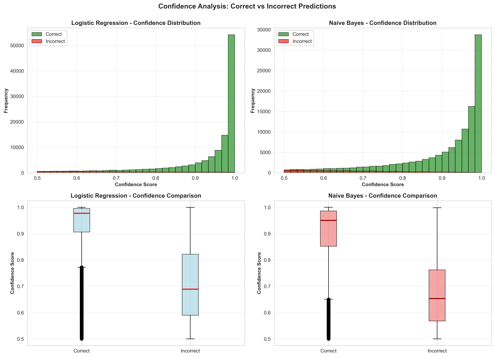

**Interpretation:**
- Both models are generally less confident when they are wrong (a desirable pattern).
- However, some high-confidence mistakes still occur, suggesting certain linguistic constructions can strongly mislead the models.

---

### 3) Example Misclassifications (Qualitative)

We also inspect specific misclassified texts to understand *why* the model failed (commonly due to negation, irony, or mixed sentiment). These examples help interpret how sentiment cues appear in real student language and where the pipeline could be improved.

---

## Week 5 Takeaways

1. **Interpretability is strongest for stable features** (supported by K-fold and bootstrap stability).
2. **Performance is robust** across splits, simulated “temporal” scenarios, and sample sizes.
3. **Diagnostics support trust in probability outputs**, but calibration/threshold selection matters for deployment-like use.
4. **Negation and mixed sentiment** remain the most common error modes, motivating improvements like explicit negation handling or more contextual models.

---
## Week 6: Synthesis & Communication Readiness

This week finalizes the analytic pipeline, synthesizes results from Weeks 4–5, interprets findings in light of the research question, documents limitations and scope, and prepares the repository and figures for the final presentation.

---

### Final Analytic Configuration and Stopping Justification

The final model is a **Logistic Regression** classifier with the following configuration:

| Parameter | Value |
|-----------|-------|
| Feature representation | TF-IDF |
| Max features | 10,000 |
| N-gram range | (1, 2) — unigrams + bigrams |
| Stopwords | Standard English + domain-specific |
| Class weighting | `class_weight='balanced'` |
| Regularization | C = 1.0 |
| Solver | `liblinear` |

**Why this configuration?**
Week 4's controlled experiments showed that this combination consistently outperformed alternatives across all four preprocessing dimensions (domain stopwords, vocabulary size, n-gram range, and stemming). Naive Bayes was retained as a baseline comparator but did not exceed LR on any primary metric.

**Stopping criterion:**
> Cease model iteration when validation performance improvement is ≤ 0.005 for two consecutive model updates, or when additional complexity hurts generalization.

This threshold was met after the LR vs NB comparison and the preprocessing ablations showed diminishing returns. The Week 6 code formalizes this by programmatically scanning the notebook for model objects and tracked metrics, then exporting the complete configuration and stopping rationale to `outputs/week6/final_analytic_configuration.json`.

**Performance at stopping point:**

| Metric | Logistic Regression | Naive Bayes |
|--------|-------------------:|------------:|
| Accuracy | 0.9268 | 0.9230 |
| F1-Score | 0.9280 | 0.9210 |
| ROC-AUC | ~0.97 | ~0.96 |

---

### Substantive Interpretation of Results

Synthesizing across Weeks 4–6, the analysis confirms that open-text student reviews carry meaningful information that a single numerical rating cannot express.

**What positive reviews reveal:**
The Logistic Regression coefficients show that positive sentiment is driven by words signaling instructor care and approachability ("cares," "helped," "willing"), experiential quality ("amazing," "excellent"), and course structure. These patterns were confirmed as **stable** by Week 5's K-Fold and Bootstrap analyses — top predictive features maintained sign consistency above 95% and narrow confidence intervals across resamples.

**What negative reviews reveal:**
Negative sentiment clusters around interpersonal conflict, disorganization, and perceived unfairness. Both models agree on the core negative predictors, with high overlap in their top-50 feature lists.

**Robustness of findings:**
- Cross-validation showed **low variance** across 5 folds
- Temporal validation maintained accuracy around **0.927** across sequential splits
- Sample-size sensitivity showed **0.913 accuracy at just 10%** of training data
- These patterns indicate the findings are robust rather than artifacts of a particular data partition

**Answering the research question:**
Text reviews surface relational and organizational dimensions of teaching quality — particularly instructor care, accessibility, and course structure — that a numerical rating collapses into a single score. The model identifies *which specific aspects* of teaching drive student satisfaction or dissatisfaction, providing actionable detail that aggregate scores cannot.

---

### Limitations and Scope

| Limitation | Why It Matters | Scope Boundary | Mitigation / Next Step |
|------------|---------------|----------------|----------------------|
| Class imbalance (~2.6:1 positive-to-negative) | Can inflate aggregate metrics while masking minority-class underperformance | Findings are strongest for classes with adequate training samples | Report per-class metrics; evaluate re-sampling or cost-sensitive learning |
| Observational, context-specific data | Limits causal claims and out-of-context generalization | Conclusions are predictive associations, not causal effects | Validate on external or temporally shifted holdout data |
| Finite model search budget | Global optimum may not be reached | Best model is conditional on tested algorithms and hyperparameter ranges | Expand search space only if expected gain justifies compute cost |
| No temporal metadata | Temporal validation relies on row-order as a proxy | Simulated temporal splits may not reflect true temporal drift | Collect or recover date information for future validation |
| Negation-driven errors (44.6% of LR errors) | Signals a ceiling for bag-of-words models | Performance bound inherent to TF-IDF representation | Explore sequence-aware models or explicit negation handling |

These limitations are also exported to `outputs/week6/limitations_and_scope_draft.csv` for transparency and future reference.

---

### Draft Presentation Figures

The Week 6 code generates presentation-ready draft figures conditionally based on available notebook variables:
- **Core evaluation metrics** bar chart (when `metric_summary` is available)
- **Confusion matrix** display (when `y_true` and `y_pred` are available)

All figures are saved at **200 DPI** to `outputs/week6/figures/` for direct inclusion in the final presentation.

---

### GitHub Repository and Reproducibility

The repository is now organized in near-final form:

| Directory / File | Contents |
|-----------------|----------|
| `models.ipynb` | Complete pipeline: Week 4 (operationalization & training) → Week 5 (diagnostics & robustness) → Week 6 (synthesis & communication) |
| `Assets/` | Processed data, saved models (`.pkl`), vectorizer, split indices, domain stopwords |
| `outputs/week6/` | Final configuration JSON, limitations CSV, draft figures, reproducibility manifest |
| `Images/` | All figures referenced in this README |

**Reproducibility artifacts generated:**
- `requirements_snapshot.txt` — full `pip freeze` of the runtime environment
- `reproducibility_manifest.json` — artifact listing with Python version and platform details

This ensures that any reviewer can clone the repository and reproduce results end to end.

---

## Week 6 Takeaways

1. **Logistic Regression is the final selected model**, justified by consistent superiority over Naive Bayes across all preprocessing experiments and robustness checks.
2. **The stopping criterion was met** — validation improvements fell below 0.005, and added complexity (stemming, larger vocabularies) did not meaningfully improve generalization.
3. **Text reviews provide actionable pedagogical insight** beyond numerical ratings, surfacing specific relational and organizational factors that drive student sentiment.
4. **Limitations are clearly scoped** — class imbalance, observational design, and negation-handling ceilings are documented with concrete mitigation paths.
5. **The repository is reproducible** — environment snapshots, artifact manifests, and organized directory structure support independent replication.

---