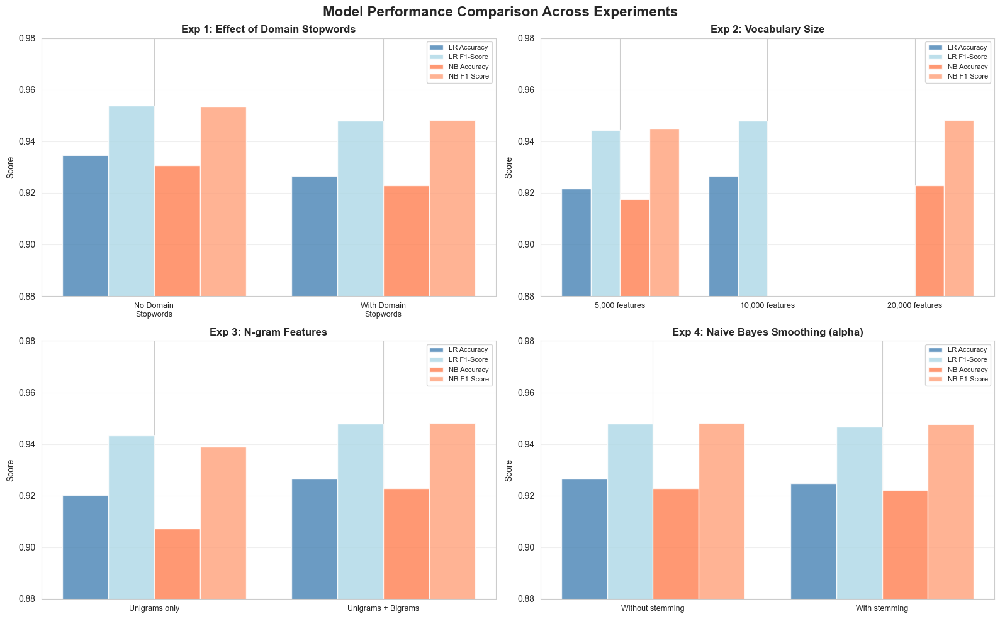
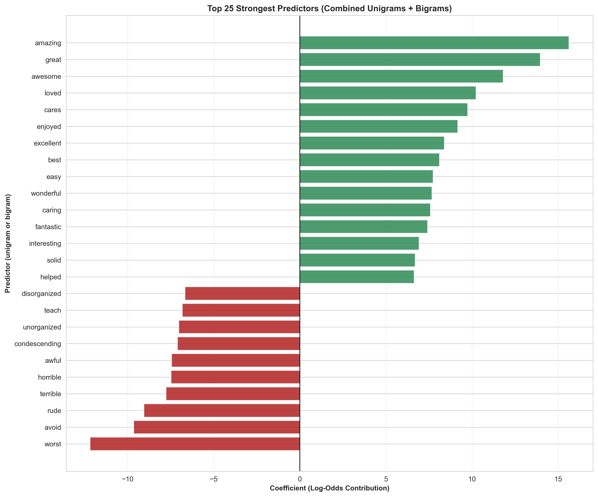
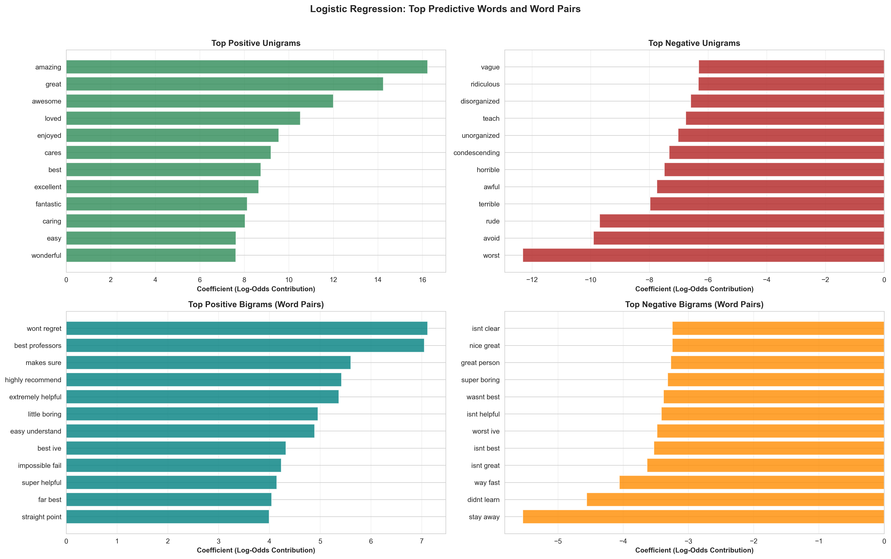
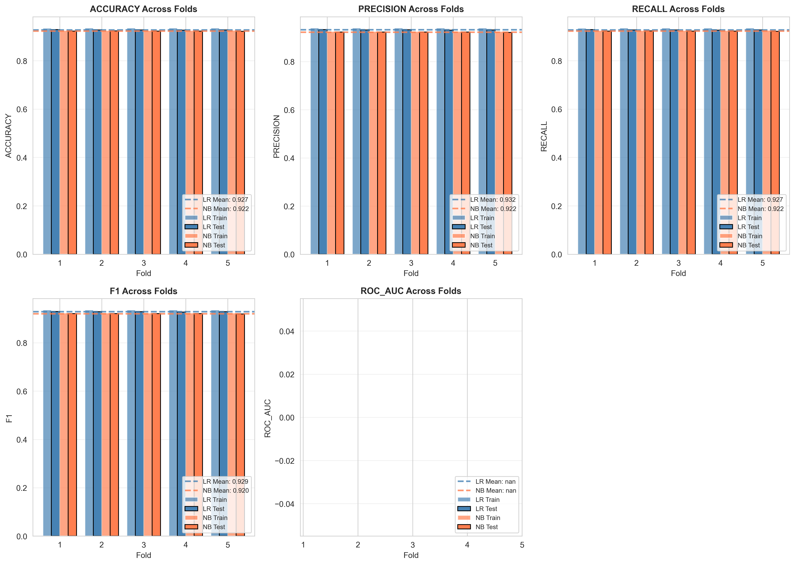
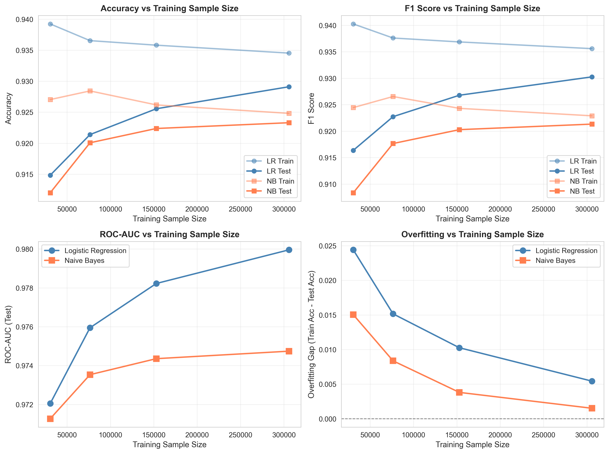

# Sentiment Analysis of Student Reviews

**Author:** Bikalpa Panthi  

---

## 📄 Project Report

👉 **[View the Full Report on GitHub Pages](https://3028bikalpa.github.io/SOSC314/)**

---

## Project Summary

This project applies supervised machine learning to over 436,000 RateMyProfessors reviews to answer a core social science question: **What information do open-text student reviews provide beyond numerical ratings, and can text analysis identify actionable feedback that ratings alone miss?**

Reviews are converted into TF-IDF features (unigrams + bigrams, 10K vocabulary) and classified as positive or negative using Logistic Regression and Naive Bayes. Rather than pursuing accuracy alone, the project emphasizes **interpretability** — using model coefficients to surface the specific words and themes that drive student satisfaction and dissatisfaction.

### Key Findings

- **Logistic Regression achieves 92.9% accuracy** and outperforms the Naive Bayes baseline on precision and F1-score.
- **Interpersonal warmth matters most**: words like *cares*, *helped*, and *willing* are among the strongest positive predictors.
- **Rudeness outweighs difficulty**: *rude* is a far stronger negative predictor than *hard*, suggesting how instructors treat students matters more than course difficulty.
- **19 out of 20 top features** are stable across resampling with 100% sign consistency.


---

## Research Question

> What information do open-text student reviews provide beyond numerical ratings, and can text analysis identify actionable feedback that ratings alone miss?

### Why It Matters

Numerical ratings collapse rich, multidimensional student experiences into a single number. A professor rated 3.5/5 may be praised for expertise but criticized for disorganization — nuances that vanish in the aggregate. This project translates raw student language into structured, actionable insights for faculty development.

---

## Data

- **Source:** [ZephyrUtopia/ratemyprofessors_reviews](https://huggingface.co/datasets/ZephyrUtopia/ratemyprofessors_reviews) on HuggingFace
- **Raw reviews:** 480,342
- **After cleaning:** 436,836
- **Train set:** 305,785 (70%) · **Test set:** 131,051 (30%)
- **Target:** Binary sentiment — Positive (rating 4–5) vs. Negative (rating 1–2); rating 3 excluded



### Preprocessing Pipeline

1. Remove half-point ratings (1.5, 2.5, 3.5, 4.5)
2. Lowercase all text
3. Remove URLs
4. Normalize whitespace
5. Remove short reviews (< 5 words)
6. Create binary sentiment labels
7. Remove neutral ratings (rating = 3)
8. 70/30 stratified train-test split

---

## Methods

### Controlled Experiments

Four controlled experiments determined the optimal TF-IDF configuration:

| Parameter | Finding | Decision |
|-----------|---------|----------|
| Domain Stopwords | Removing hurt LR accuracy by 0.7% | Keep (It was kept despite of reducing the performance because I thought this might be a good practice for projects in general and wanted to experiment with its implementation as well) |
| Vocabulary Size | 10K improved over 5K by 0.45% | 10,000 features |
| N-gram Range | Unigrams + Bigrams improved by 0.75% | Unigrams + Bigrams |
| Stemming | Reduced accuracy by 0.25% | No stemming |


### Models

- **Baseline — Naive Bayes:** Fast, probabilistic; assumes feature independence. Accuracy: 92.3%.
- **Selected — Logistic Regression:** Interpretable coefficients, `class_weight='balanced'` for imbalance handling, calibrated probabilities. Accuracy: 92.9%.

---

## Results

| Metric | Logistic Regression | Naive Bayes |
|--------|-------------------|-------------|
| Accuracy | 0.929 | 0.923 |
| Precision | 0.972 | 0.924 |
| Recall | 0.929 | 0.975 |
| F1-Score | 0.950 | 0.948 |

### Feature Importance

The model coefficients reveal what students actually care about:



**Positive drivers:** caring and support (*cares, helped, willing*), quality of experience (*amazing, awesome, excellent*), ease and accessibility (*easy, clear, helpful*)

**Negative drivers:** interpersonal conflict (*rude, condescending, awful*), disengagement (*boring, waste, useless*), avoidance signals (*avoid, stay away*)



---

## Diagnostics and Robustness

### Confusion Matrix


### Calibration Curves

LR is well-calibrated — its predicted probabilities closely match observed frequencies.


### ROC and Precision-Recall Curves


### Error Analysis

Negation is the primary failure mode — "not amazing" gets misread as positive.


### Feature Stability

19/20 top features are stable across K-Fold and Bootstrap resampling with 100% sign consistency.


### Robustness Checks

- **5-Fold Cross-Validation:** LR accuracy = 0.9273 ± 0.0007
- **Row-Order Validation:** No meaningful degradation (Early→Recent: 92.51%)
- **Sample Size Sensitivity:** 91.3% accuracy with just 10% of data





---

## Repository Structure

```
SOSC314/
├── Assets/                          # Processed data and saved models
│   ├── processed_reviews.csv.gz
│   ├── split_indices.json
│   ├── domain_stopwords.json
│   ├── model_lr.pkl
│   ├── model_nb.pkl
│   └── vectorizer_tfidf.pkl
├── Codes/                           # All notebooks
│   ├── project_code.ipynb           # Data loading, cleaning, EDA
│   ├── models.ipynb                 # Model exploration and tuning
│   ├── final_code.ipynb             # Final pipeline: experiments, models, diagnostics
│   └── outputs/week6/               # Generated figures and artifacts
├── Images/                          # All figures used in the report
├── .venv/                           # Python virtual environment
├── .gitignore
└── README.md
```

---

## Reproducing Results

### Prerequisites

- Python 3.10+
- pip

### Step 1: Clone and set up environment

```bash
git clone https://github.com/bikalpa-panthi/SOSC314.git
cd SOSC314
python -m venv .venv
source .venv/bin/activate        # On Windows: .venv\Scripts\activate
pip install -r requirements.txt
```

### Step 2: Install dependencies

If `requirements.txt` is not present, install manually:

```bash
pip install pandas numpy scikit-learn matplotlib seaborn nltk datasets jupyter
```

### Step 3: Run notebooks in order

| Order | Notebook | Purpose |
|-------|----------|---------|
| 1 | `Codes/project_code.ipynb` | Load data from HuggingFace, clean, preprocess, EDA, save to `Assets/` |
| 2 | `Codes/models.ipynb` | Model exploration and initial tuning |
| 3 | `Codes/final_code.ipynb` | Controlled experiments, final model training, diagnostics, robustness checks, error analysis |

```bash
cd Codes
jupyter notebook
```

Run each notebook top-to-bottom in the order above. Notebook 1 downloads the dataset from HuggingFace and saves processed files to `Assets/`. Notebooks 2 and 3 load from `Assets/`.

### Data Access

The dataset is publicly available and downloaded automatically in `project_code.ipynb` via:

```python
from datasets import load_dataset
dataset = load_dataset("ZephyrUtopia/ratemyprofessors_reviews")
```

No manual data download is required.

### My device specification
- OS: MacOS Tahoe 26.3
- Device: Macbook Air
- Chip: Apple M2
- RAM: 16 GB
- Storage: 256 GB
- Python 3.14
- IDE: VS Code

---

## References

- ZephyrUtopia. *RateMyProfessors Reviews Dataset.* HuggingFace. [Link](https://huggingface.co/datasets/ZephyrUtopia/ratemyprofessors_reviews)

### AI Acknowledgment
AI was used in writing some of the codes along with helping to rephrase the language in the report. The major contribution of GenAI tool was in code enhancement, language rephrasing for reports (improving sentence structure and grammar), image decoration (enhancing the designs of the images that resulted as an output of the codes) and writing of code outside the scope of SOSC 314 class at DKU.
